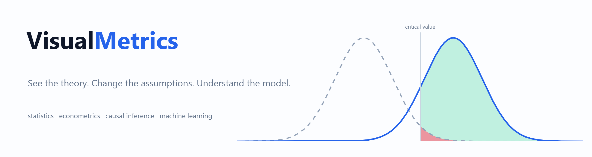
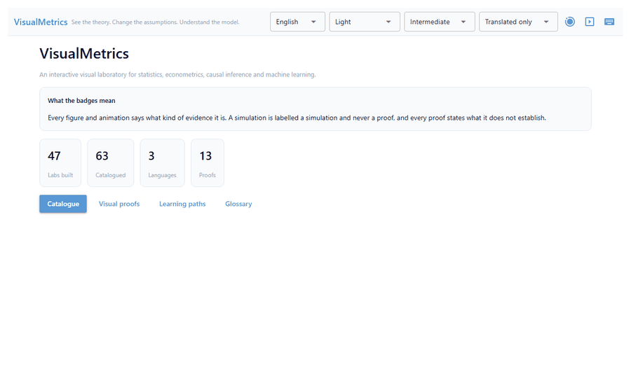

# VisualMetrics



**See the theory. Change the assumptions. Understand the model.**

An interactive visual laboratory for statistics, statistical inference,
econometrics, causal inference, machine learning and modern AI - in English,
Arabic and French.

<div class="grid cards" markdown>

- **47 labs built** across 15 canonical domains
- **13 proofs**, each stating what it does not establish
- **3 languages**, with true right-to-left Arabic
- **189 learning objectives** covering every implemented lab

</div>

## See it in one minute



*A real recording: the catalogue, a lab, changing the assumption, the animation
explaining itself frame by frame, a proof, and the same lab in Arabic.*

## What makes it different

Most teaching tools show you a picture. This one tells you what kind of thing
the picture is.

Every figure and animation declares its **evidence type**. A geometric proof
and a Monte Carlo study are different kinds of claim, so they never wear the
same badge, and the badge travels with the figure into every export. A
simulation is labelled a simulation - never a proof - and that rule is enforced
by the code and by the test suite, not merely intended.

Every animation carries an **explanation layer**: what you see, what changed,
why it changed, how to read it and what to conclude, beside the figure rather
than in a caption below it. An animation without that layer is refused.

Every proof states **what it does not establish**. A `ProofSpec` will not
construct without it.

The catalogue **never overstates itself**. 16 concepts are
catalogued but not built; they are listed, marked as planned, and refuse to
open with an explanation.

## Start here

- [Installation](getting-started/installation.md)
- [The GUI](getting-started/gui.md) - the fastest way to see what this is
- [The Python API](getting-started/api.md)
- [Evidence types](principles/evidence.md) - the idea the whole package rests on

## A first look

```python
import visualmetrics as vm

result = vm.lab("inference.power", effect_size=0.4, n=60)

result.evidence            # EvidenceType.SIMULATION - stated, not implied
result.metric_dict()       # the numbers
result.figure              # the figure
print(result.code)         # the exact Python that reproduces this run
```
